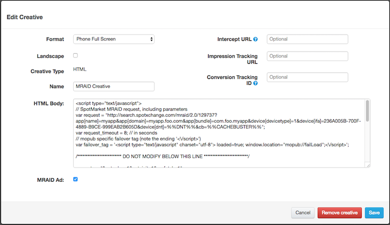

# SpotX - MoPub MRAID Creative Script

The SpotX MoPub MRAID creative script should be used to create MRAID creatives in the MoPub interface.

There are two versions of the script in this repository:

  * `mraid.html` (verbose)
  
  * `mraid.min.html` (minified)

Both scripts contain identical functionality.  The `mraid.min.html` file has been minified
using [UglifyJS2](https://github.com/mishoo/UglifyJS2). 

##Usage
To use the script, copy the *entire* text from a script file into the `'HTML Body'` section
of the MRAID creative definition.  You may use either version of the script (verbose or minified)
since the functionality is identical.   



> Always make sure to check the `'MRAID Ad'` option.

To customize the script you should only edit the first few lines.
```javascript
// SpotMarket MRAID request, including parameters
var request = "http://search.spotxchange.com/mraid/2.0/123456?app[name]=myapp&app[domain]=myapp.foo.com&app[bundle]=com.foo.myapp&device[devicetype]=1&device[ifa]=236A005B-700F-4889-B9CE-999EAB2B605D&device[dnt]=%%DNT%%&cb=%%CACHEBUSTER%%";
var request_timeout = 8; // in seconds
// mopub specific failover tag (note the ending '<\/script>')
var failover_tag = '<script type="text/javascript" charset="utf-8"> loaded=true; window.location="mopub://failLoad";<\/script>';
```
You should modify the `request` url with the SpotX Channel ID and the corresponding MRAID parameters.
In the above example, the Channel ID is `123456`, and the parameters are the name value pairs after the
`'?'` in the url. For more information see the section: [SpotMarket MRAID Request Parameters](#spotmarket-mraid-request-parameters) 

The `request_timeout` value is the number of seconds to wait for a response from SpotX.  In the above
example the value is set to `8` seconds.

The `failover_tag` variable contains the custom `<script>` tag used by MoPub to indicate a failover condition.
Normally this tag should not be modified, unless there are changes to the current MoPub MRAID container
specification - see the *Failover tag* section in the [MoPub Custom Networks](https://dev.twitter.com/mopub/ui-setup/custom-networks)
document.

In the current `mraid.html` and `mraid.min.html` files you must update the `var request = ...` parameter with your information. 
```javascript
var request = "http://search.spotxchange.com/mraid/2.0/REPLACE_CHANNEL_ID?app[name]=REPLACE_ME&app[domain]=REPLACE_ME&app[bundle]=REPLACE_ME&device[devicetype]=1&device[ifa]=REPLACE_ME&device[dnt]=%%DNT%%&cb=%%CACHEBUSTER%%";
```
You must replace the `REPLACE_CHANNEL_ID` text with the SpotX Channel ID you want to syndicate, and the `REPLACE_ME` text
with the proper values, described in the [SpotMarket MRAID Request Parameters](#spotmarket-mraid-request-parameters) section.

##SpotMarket MRAID Request Parameters
The SpotMarket MRAID url contains several parameters that must be specified in order to create the proper MRAID response.  When creating the url, you may also use
macros provided by MoPub for the parameter values.  These macros will be substituted with their corresponding values when the script is obtained by the client's MRAID container.
For more information about the MoPub Macros, check out the [MoPub Documentation](https://dev.twitter.com/mopub/ui/macros). 
The following table contains the currently supported parameters:

###Application Data
|Parameter             | Description / Example | Type | Usage |
|----------------------|-----------------------|------|-------|
|`app[name]`           | Defines the name of the application.<br/><br/>`app[name]=mygame` | String | Required |
|`app[domain]`         | Domain of the application.<br/><br/>`app[domain]=mygame.foo.com` | String | Required |
|`app[bundle]`         | Defines the application bundle or package name. This is intended to be a unique ID across multiple exchanges.<br/><br/>`app[bundle]=com.foo.mygame` | String | Required |
|`app[cat]`            | Array of IAB content categories for the overall application.<sup>1</sup><br/><br/>`app[cat]=IAB6-8` | Array | Recommended |
|`app[storeurl]`       | For QAG 1.5 compliance, an app store URL for an installed app should be passed in the bid request.<br/><br/>`app[storeurl]=http%3A%2F%2Fplay.google.com%2Fmygame` | String | Recommended |
|`app[ver]`            | Application version.<br/><br/>`app[ver]=1.2.1` | String | Optional |
|`app[privacypolicy]`  | Specifies whether the app has a privacy policy. “1” means there is a policy and “0” means there is not.<br/><br/>`app[privacypolicy]=1` | Integer | Optional |

###Device Data
|Parameter              | Description / Example | Type | Usage | MoPub Macro |
|-----------------------|-----------------------|------|-------|-------------|
|`device[devicetype]`   | Defines the type of device being used <sup>1</sup><br/><br/>`device[devicetype]=1` | Integer | Required | |
|`device[dnt]`          | If “0”, then do not track Is set to false, if “1”, then do no track is set to true in browser.<br/><br/>`device[dnt]=0`| String | Required | `%%DNT%%` |
|`device[ifa]`          | ID sanctioned for advertiser use in the clear, not hashed (i.e., Android ID or Apple IDFA for iOS).<br/><br/>`device[ifa]=236A005B-700F-4889-B9CE-999EAB2B605D` | String | Required | `%eudid!`<sup>2</sup> |
|`device[dpidsha1]`     | Platform device ID (i.e., Android ID or Apple IDFA for iOS); hashed via SHA1.<br/><br/>`device[dpidsha1]=1a847de9f24b18eee3fac634b833b7887b32dea3` | String | Optional |`%eudid!`<sup>2</sup> |
|`device[geo][lat]`     | Latitude from -90 to 90. South is negative. This should only be passed if known to be accurate<br/><br/>`device[geo][lat]=39.8967` | Float | Optional<sup>3</sup> | `%%LATITUDE%%` |
|`device[geo][lon]`     | Longitude from -180 to 180. West is negative. This should only be passed if known to be accurate.<br/><br/>`device[geo][lon]=-105.0738` | Float | Optional<sup>3</sup> | `%%LONGITUDE%%` |

###Site Data
|Parameter              | Description / Example | Type | Usage | MoPub Macro |
|-----------------------|-----------------------|------|-------|-------------|
|`cb`                   | Cache Buster - Defines a dynamically generated random number.<br/><br/>`cb=78948946351` | Integer | Required | `%%CACHEBUSTER%%` |
|`site[cat]`            | Array of IAB content categories of the site.<sup>1</sup><br/><br/>`site[cat]=IAB6-8` | Array | Recommended | &nbsp; |

> <sup>1</sup> The parameter values may be found in the [OpenRTB API Specification 2.2](http://www.iab.com/wp-content/uploads/2015/06/OpenRTBAPISpecificationVersion2_2.pdf).<br/>
> <sup>2</sup> IDFA, SHA1 Hashed Android ID, or Android Advertising ID (if Google Play Services is integrated).<br/>
> <sup>3</sup> While `device[geo][lon]` and `device[geo][lat]` are optional, if either parameter is specified, then the other parameter must be specified.  The substitution of these
values may not occur if the MRAID container app does not provide location services. 

###SpotX Custom Parameters
There are additional parameters that are custom to SpotX.  These parameters are required, and automatically be appended to the SpotMarket request url.
You should not have to modify these parameters.  The details of these parameters are provided here for completeness.

|Parameter              | Description | Default Usage |
|-----------------------|-------------|---------------|
|`autoinit`             | Automatically initialize the MRAID creative and prepare for playback. | `autoinit=1` |
|`autoplay`             | Automatically begin playing the creative when ready. | `autoplay=1` |
|`prefetch`             | Fetch the creative on the server, at the time of the request. | `prefetch=1` |

##Error Handling - MoPub Failover
MoPub provides a custom failover tag that may be executed in certain error conditions, such as network
timeout, or no eligible ad available (no fill).  The MRAID script will automatically call the MoPub failover
tag when these types of errors are detected.

The failover tag will be called in the following instances:

* SpotMarket request timeout
* Invalid SpotMarket Channel (HTTP 204 error)
* Invalid SpotMarket URL (HTTP 404/403 errors)
* Disabled Channel
* VPAID *AdError* (for Opt-Out conditions) <sup>4</sup>

> <sup>4</sup> If a VPAID *AdError* occurs before the VPAID *AdImpression* event is fired, the failover tag
will be called.  This situation will typically occur if the MRAID ad contains a VPAID creative that decides
not to bid on the slot and errors out, before the impression.  If the *AdError* event occurs after the
*AdImpression*, the failover tag will not be issued since the ad impression has already been counted. 